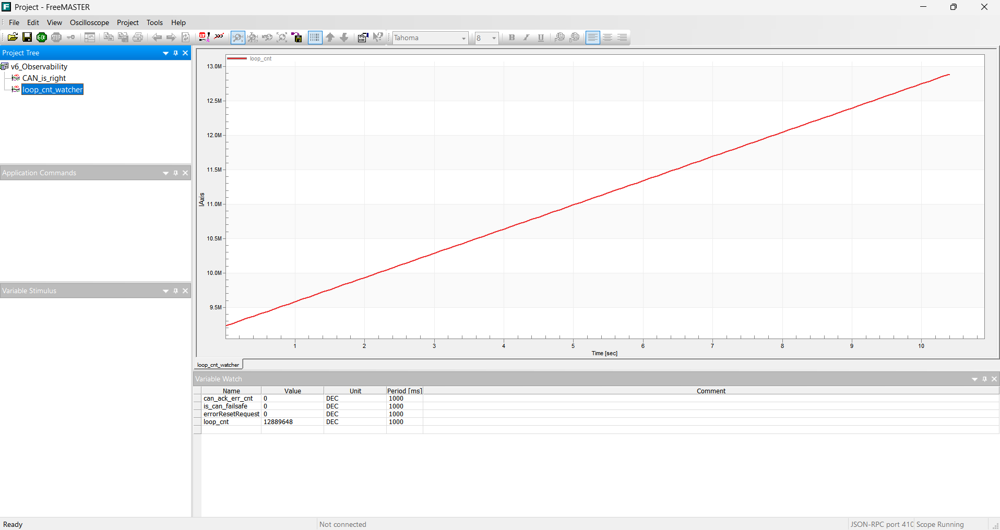
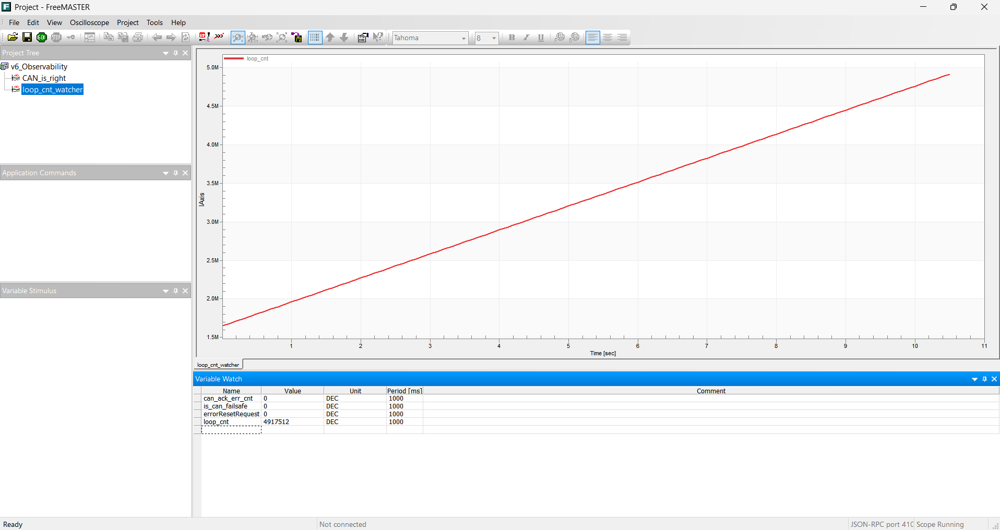

# 📘 S32K144 Embedded Systems: Smart Wiper Evolution
> **From 42 Gyeongsan (Software Fundamentals) to Automotive System Architecture.**

[English](README.md) | [한국어](README_ko.md)

This repository documents the development of a Smart Wiper System using the NXP S32K144EVB. It captures the complete engineering journey—evolving from basic control logic to hardware acceleration (DMA), digital signal processing (DSP), and eventually to a **standard automotive network (CAN)** and **AUTOSAR architecture**.

---

## 🏎️ Project Roadmap: Architectural Evolution

This project focuses on the architectural paradigm shifts required to ensure the **Real-time processing** and **Absolute Reliability** critical for automotive Electronic Control Units (ECUs).

### [Phase 1] Foundation (v1 ~ v4)
- **FSM Control**: Implemented Finite State Machine (FSM) wiper modes (STOP, INT, LOW, HIGH).
- **Hard Real-time**: Guaranteed strict 10ms periodic tasks via LPIT timer interrupts.
- **Hardware Acceleration**: Achieved zero-overhead analog sensing by offloading CPU data acquisition to eDMA.

### [Phase 2] Reliability & DSP (v5)
- **Signal Integrity**: Integrated a **Moving Average Filter** to eliminate sensor noise and prevent control jitter.
- **Failsafe Design**: Built diagnostic logic for hardware faults (open/short circuits) and sudden signal anomalies (Delta Check).
- **Layered Refactoring**: Decoupled high-level application logic from the Hardware Abstraction Layer (HAL) to maximize portability.

### [Phase 3] Distributed Systems & Network (v6 ~ v7)
- **Asynchronous Optimization (v6)**: Migrated heavy processing from ISRs to the Main Loop using a **Foreground-Background Scheduling** model.
- **Automotive Networking (v7)**: Developed a Master-Slave distributed control system over a physical CAN bus.
- **Network Fail-safe**: Programmed Slave nodes to autonomously revert to a Safe-state (Wiper Home Position) upon CAN bus-off or communication loss.

### [Phase 4] Next Generation (Current) 🚀
- **AUTOSAR Paradigm**: Standardizing the software platform using NXP RTD and the **EB tresos** ecosystem.
- **Closed-loop Control**: Implementing a robust PID controller for precise DC Motor + Encoder feedback actuation.

---

## 🔌 Technical Highlights

### 1. Foreground-Background Scheduling & CPU Load Analysis (v6)
To maximize system responsiveness, heavy computational control logic was detached from the ISRs and migrated to the `while(1)` background loop. The 10ms ISR now strictly serves to generate light execution flags. The resulting CPU idle bandwidth (Slack Time) was empirically verified by profiling the main loop execution frequency (`loop_cnt`) over a deterministic 10-second window.

**Quantitative Performance Metrics (10s Window Execution Summary):**

| Measurement Scenario | Main Loop Rotation (Loop Count) | CPU Usage | CPU Slack Time (Idle Bandwidth) | Engineering Status |
| :--- | :---: | :---: | :---: | :--- |
| **Baseline** (No Task) | 12.7M counts | 0% | **100%** | Reference Idle State |
| **Active** (Wiper Task On) | 4.7M counts | ~63% | **37%** | **Passed** (Within Automotive Safety Margin < 70%) |

📊 View FreeMASTER Real-time DAQ Graphs

#### Baseline (No Task) - 12.7M Counts
**

#### Active (Wiper Task On) - 4.7M Counts
**

*(Data captured and visualized empirically via FreeMASTER DAQ, proving that the system handles real-time wiper actuation with deterministic margins while leaving sufficient bandwidth for future network tasks.)*

### 2. Low-Overhead DSP Pipeline
ADC sample accumulation and transfers are entirely automated via eDMA. To minimize execution time within the CPU window, the moving average division is optimized at the register level using bitwise right-shifts (`adcSum >> 3U`), maximizing the efficiency of the Cortex-M4F core.

### 3. Automotive Failsafe Strategy
If sensor delta variations exceed physical boundary limits (`MAX_DELTA`) or electrical faults are diagnosed, the ECU instantly forces a transition into a Safe-state (`MODE_OFF`), overriding user inputs to return the wiper to its structural home position.

---

## 🛠 Tech Stack & Tools

- **MCU**: NXP S32K144 (ARM Cortex-M4F)
- **IDE / Tools**: S32 Design Studio v3.5, **EB tresos Studio**, FreeMASTER DAQ
- **Protocols**: CAN 2.0B, LPUART, SPI
- **Standards**: Foreground-Background, AUTOSAR Classic Architecture (In Progress)
- **Language**: Embedded C (MISRA-C compliance oriented)

---

## 📝 Engineering Practices

- **Bare-Metal & Register Mastery**: Direct register manipulation (MMIO) driven directly by the **S32K1xx Reference Manual**, avoiding black-box dependencies during foundation phases.
- **Data-Driven Validation**: Empirical verification and control loop tuning performed through live memory visualization using **FreeMASTER DAQ graphs**.
- **System-Level Thinking**: Prioritizing overall data coherency, task priorities, and CPU slack time over the isolated operation of individual peripherals.

---

## 📎 References
- [S32K1xx Series Reference Manual](https://www.nxp.com/webapp/Download?colCode=S32K1XXRM)
- [AN5413: S32K144 Series Cookbook](https://www.nxp.com/webapp/Download?colCode=AN5413)
