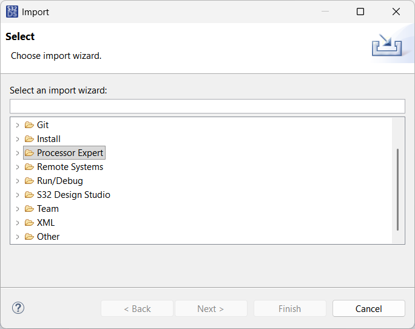
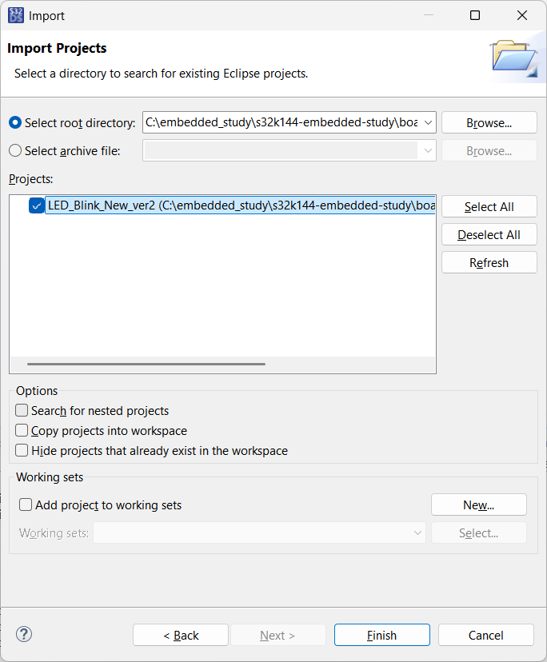
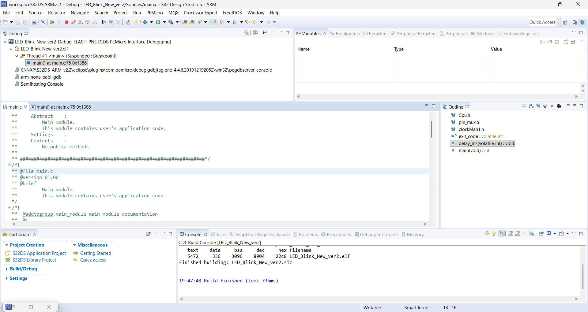
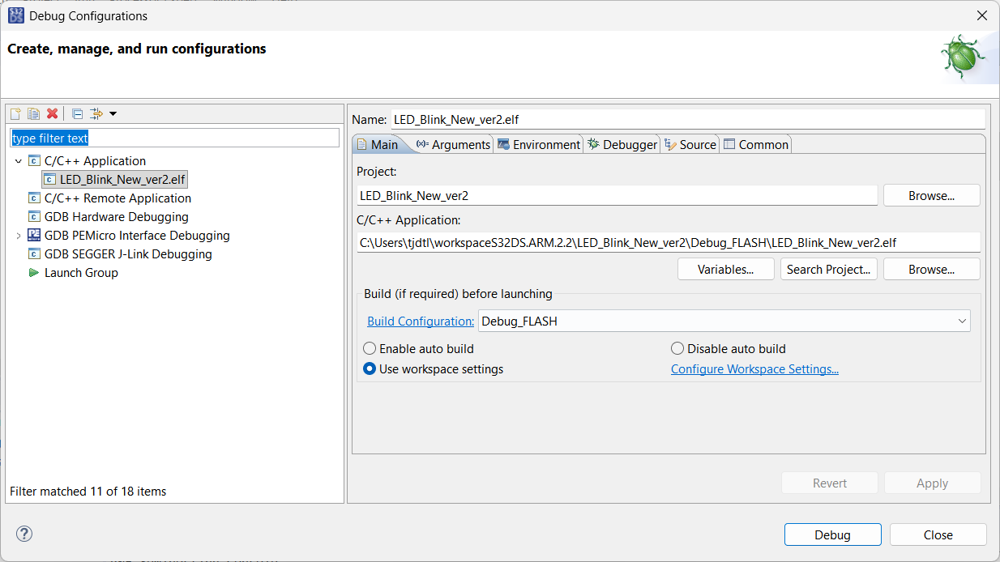
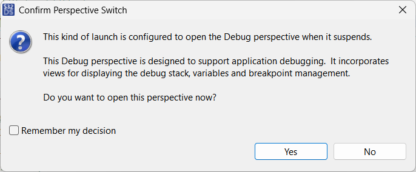
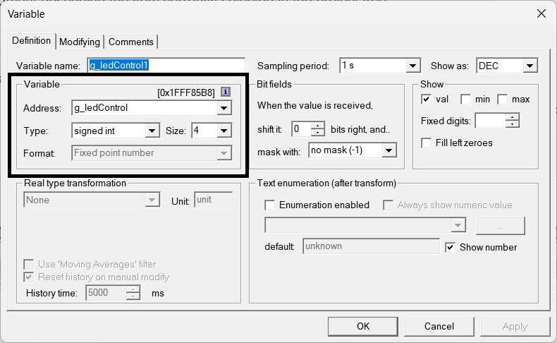

# 01. GPIO Output - LED Blinking

## 1. 학습 목표
* S32K144EVB 보드의 RGB LED(Blue/Red)를 제어한다.
* **S32 Design Studio (S32DS)의 프로젝트 관리 및 디버깅 환경을 구축한다.** (가장 중요)

## 2. 하드웨어 분석
* **MCU:** NXP S32K144
* **LED 연결 (Schematic):**
    * BLUE LED: `PTD0` (Port D, 0번 핀)
    * RED LED: `PTD15` (Port D, 15번 핀)
    * **동작 방식:** Output Low(0) -> ON / Output High(1) -> OFF (회로도 확인 필요)

## 3. 개발 환경 구축 (Troubleshooting Log)
**이 프로젝트를 시작하면서 겪었던 환경 설정 이슈와 해결책을 정리함.**

### 3.1. 프로젝트 위치 선정 (Windows vs WSL)
* **이슈:** 코드는 WSL(Ubuntu)에서 `git`으로 관리하고 싶고, 빌드는 Windows S32DS에서 해야 함.
* **해결:**
    1. Git 리포지토리를 **Windows 파일 시스템(`C:\Embedded_Study\...`)**에 생성.
    2. WSL2 터미널에서 `/mnt/c/Embedded_Study/...`로 접근하여 git 관리.
    3. S32DS는 Windows 경로의 파일을 직접 로드.
    * *교훈: WSL 내부에 프로젝트를 두면 S32DS가 경로를 못 찾거나 빌드가 매우 느려짐.*

### 3.2. 기존 프로젝트 불러오기 (Import)
* **상황:** Git으로 클론한 프로젝트를 S32DS에 인식시켜야 함.
* **방법:**
    1. `File` -> `Import` -> `General` -> `Existing Projects into Workspace`
    2. **주의:** `Copy projects into workspace` 체크박스를 **반드시 해제**해야 함. (체크하면 파일이 복사되어 Git 관리가 꼬임)




### 3.3. 실행 에러 (Run vs Debug)
* **에러:** 상단 재생 버튼(Run)을 눌렀더니 `Cannot run program... launching failed` 에러 발생.


* **원인:** PC(x86)에서 ARM용 `.elf` 파일을 실행하려 했기 때문.
* **해결:**
    1. **Run(재생 버튼) 금지.**
    2. 벌레 모양 아이콘(`Debug`) 옆 화살표 -> `Debug Configurations`
    3. `GDB PEMicro Interface Debugging` 선택.
    4. Interface가 `OpenSDA` (USB)인지 확인 후 `Debug` 클릭.


    5. 이후에는 **F8 (Resume)** 키를 눌러서 실행.


### 3.4. [Critical] SDK API 호출 시 치명적 실수 (Watchdog/HardFault 원인)
* **상황:** 빌드는 정상적으로 되는데, 디버깅 시작 직후 `WDOG_EWM_IRQHandler` (Watchdog 인터럽트) 혹은 `HardFault`에 빠지며 멈춤.
* **초기 분석 오판:** 로그에 Watchdog이 뜨길래 Watchdog 초기화가 안 된 줄 알고 `WDOG_Disable` 함수만 계속 찾음.
* **진짜 원인:** **C언어 포인터/배열 파라미터 전달 실수.**
    * NXP SDK의 `CLOCK_SYS_Init` 등의 함수는 설정 구조체의 **배열(포인터)**을 인자로 받음.
    * 이미 배열(`g_clockManConfigsArr`) 자체가 포인터 역할을 하는데, 습관적으로 주소 연산자 `&`를 붙여서 넘김.
    * 함수 내부에서 엉뚱한 메모리 주소(쓰레기 값)를 참조하다가 시스템이 뻗어버림.

* **해결 코드 비교:**
```c
/* [X] 잘못된 작성법 (HardFault 발생) */
// 배열의 주소(&)를 넘기면 이중 포인터가 되어 엉뚱한 값을 가리킴
CLOCK_SYS_Init(&g_clockManConfigsArr, ...);

/* [O] 올바른 작성법 */
// 배열의 이름은 그 자체로 첫 번째 요소의 주소(포인터)임
CLOCK_SYS_Init(g_clockManConfigsArr, ...);
```

교훈:

SDK 함수의 매개변수 타입을 정확히 확인하자. (특히 * 개수)

로그는 거짓말을 하지 않지만, 원인을 직접 말해주지도 않는다. (Watchdog 에러는 결과일 뿐, 원인은 메모리 참조 오류였다.)

### 3.5. FreeMASTER 변수 제어 실패 (Address 0x0000 이슈)
* **증상:** FreeMASTER 연결은 성공(Open)했으나, 변수 값이 `1`이 아닌 엉뚱한 값(`28672` 등)이 뜨고 제어가 안 됨.
* **원인:** `Create Watch Var` 시 변수 이름을 직접 타이핑했더니, 심볼 주소가 매핑되지 않고 **Address가 `0x0000`**으로 잡힘.
* **해결:** 1. 기존 변수 삭제.
    2. `Create Watch Var` -> 변수명 옆의 **`>>` (Symbol List)** 버튼 클릭.
    3. 리스트에서 변수를 선택하여 추가 (Address가 `0x2000...` 등으로 정상 매핑됨 확인).
* **교훈:** 변수는 반드시 심볼 리스트에서 불러와야 주소 매핑이 확실하다.

---

## 4. 코드 구현 (main.c)

### 주요 함수
```c
// 하드웨어 초기화 (pin_mux.c 설정 적용)
PINS_DRV_Init(NUM_OF_CONFIGURED_PINS, g_pin_mux_InitConfigArr);

// 핀 출력 토글
// PTD: Port D의 주소
// 1U << 15: 15번 비트(핀)를 제어
PINS_DRV_TogglePins(PTD, 1U << 15);