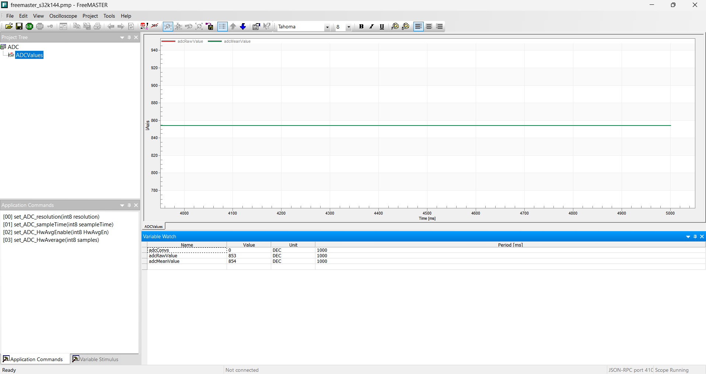

# FreeMASTER Integration

## 📝 프로젝트 개요 (Overview)
NXP S32K144EVB 보드를 활용하여 임베디드 시스템의 기초(GPIO, ADC)를 학습하고, **FreeMASTER 런타임 디버깅 툴**을 통합하여 실시간 제어 및 모니터링 환경을 구축한 프로젝트입니다.

단순한 예제 실행을 넘어, **기존 프로젝트에 통신 드라이버를 직접 이식(Porting)**하고 발생하는 하드웨어/소프트웨어 이슈를 해결하는 과정에 집중했습니다.

* **MCU:** NXP S32K144 (ARM Cortex-M4F)
* **IDE:** S32 Design Studio for ARM v2.2
* **SDK:** S32 SDK RTM v3.0.0
* **Debugging Tool:** FreeMASTER 3.x

---

## 📂 프로젝트 구성 (Projects)

### `freemaster_s32k144` (Example Analysis)
NXP SDK에서 제공하는 ADC 예제를 분석하여 **오실로스코프(Oscilloscope)** 기능을 실습한 프로젝트입니다.
* **기능:** 보드의 가변 저항(Potentiometer)을 돌릴 때 변하는 전압 값을 실시간 그래프로 시각화.
* **학습 포인트:**
    * **전역 변수(`volatile`)**와 인터럽트 핸들러(`ADC_IRQHandler`) 간의 데이터 흐름 파악.
    * Raw Data(`adcRawValue`)와 평균값(`adcMeanValue`)의 노이즈 차이 시각적 확인.

---

## 🛠️ 트러블슈팅 로그 (Troubleshooting Log) 🔥
**이 프로젝트를 진행하며 마주친 주요 에러와 해결 과정입니다.**

### 1. Debugger 연결 실패 (Launch Failure)
* **증상:** `Unable to auto-detect debug hardware` 에러 발생하며 다운로드 실패.
* **원인:** IDE의 Debug Configuration 기본값이 외장 디버거(`USB Multilink`)로 설정되어 있었음.
* **해결:** Debugger Interface를 보드 내장형인 **`OpenSDA Embedded Tower/Micro`**로 변경하여 해결.

### 2. 통신 연결 실패 (Value: ?)
* **증상:** FreeMASTER 연결은 성공(Open)했으나, 변수 값이 `?`로 뜨고 제어 불가능.
* **원인:** 소프트웨어 드라이버(`lpuart1`)는 초기화했으나, 실제 칩의 **Pin Muxing(하드웨어 핀 연결)** 설정이 누락됨.
* **해결:** `pin_mux` 컴포넌트의 LPUART 탭에서 **RX(PTC6), TX(PTC7)** 핀을 명시적으로 할당하고 코드 재생성.

### 3. 변수 주소 매핑 오류 (Address 0x0000)
* **증상:** 변수 값이 `1`이 아닌 엉뚱한 값(`28672` 등)이 출력되고 제어가 안 됨.
* **원인:** 변수 추가 시 이름을 직접 타이핑했더니, 심볼 테이블(.elf)과 매핑되지 않아 메모리 시작 주소(`0x0000`)를 참조함.
* **해결:** 변수 추가 시 **Symbol List(`>>`)** 버튼을 통해 ELF 파일에 등록된 변수를 선택하여 올바른 주소(`0x2000...`) 매핑 확인.

---

## 📸 실행 결과 (Screenshots)

### ADC 오실로스코프 (freemaster_s32k144)
> 가변 저항 조절에 따른 실시간 전압 변화 그래프

---

## 🚀 How to Run

1.  **Import Projects:** S32DS에서 `File -> Import -> Existing Projects`로 프로젝트 폴더를 불러옵니다.
2.  **Generate Code:**  프로젝트의 `ProcessorExpert.pe`를 열고 **Generate Code**를 실행합니다.
3.  **Build & Debug:** 프로젝트를 빌드하고 보드에 다운로드한 뒤 **Resume (F8)**을 눌러 실행 상태로 만듭니다.
4.  **FreeMASTER Connection:**
    * 폴더 내의 `.pmp` 파일을 엽니다.
    * **Project -> Options -> MAP Files**에서 현재 빌드된 `.elf` 경로를 다시 지정합니다.
    * **GO (Start)** 버튼을 눌러 통신을 시작합니다.