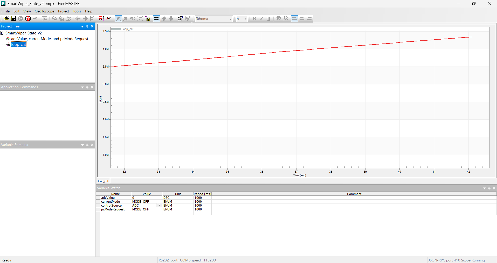

# 04_smart_wiper_dma

## 🎯 프로젝트 개요

`SmartWiper_DMA_v3`는 데이터 전송의 자동화를 통해 CPU의 부하를 획기적으로 줄인 버전입니다. 기존 방식은 CPU가 ADC 변환이 끝날 때까지 아무것도 못 하고 기다려야 했지만, 본 프로젝트에서는 **eDMA(enhanced Direct Memory Access)**를 도입하여 이 병목 현상을 해결했습니다.

## 🚀 핵심 개선 사항 (v2 vs v3)

* **CPU 자유도 (Offloading)**: ADC 데이터 전송을 하드웨어가 전담하여 CPU는 오직 제어 로직 계산에만 집중합니다.
* **실시간성 향상**: 메인 루프에서 ADC 대기 시간이 사라져 통신(FreeMASTER) 및 상태 머신의 반응 속도가 향상되었습니다.
* **하드웨어 자동화**: ADC 변환 완료 신호가 발생하면 즉시 하드웨어 트리거를 통해 DMA가 작동합니다.

## 🛠️ 기술적 세부 구현

### 1. eDMA 전송 설정 (Single Block Transfer)

S32 SDK의 `EDMA_DRV_ConfigSingleBlockTransfer` 함수를 사용하여 데이터 배송 경로를 정의했습니다.

```c
EDMA_DRV_ConfigSingleBlockTransfer(0U,
    EDMA_TRANSFER_PERIPH2PERIPH,      // 데이터 전송 후 목적지 주소 고정
    (uint32_t)&(ADC0->R[0]),          // Source: ADC 결과 레지스터 주소
    (uint32_t)&adcValue,              // Destination: RAM 변수 주소
    EDMA_TRANSFER_SIZE_2B,            // 2-byte(16-bit) 단위 전송
    2U);                              // 하드웨어 트리거당 2바이트 전송

```

### 2. 데이터 무결성을 위한 설계

* **전송 사이즈 (2-byte)**: ADC 12-bit 데이터를 담기 위해 최소 16-bit 단위 전송을 선택했습니다.
* **데이터 정렬 (Alignment)**: 2바이트 전송 시 메모리 주소는 반드시 **짝수(Even Address)**여야 하며, 이를 위반할 경우 Bus Fault가 발생할 수 있음을 확인하고 `uint16_t` 전역 변수를 활용했습니다.
* **주소 고정 (Fixed Address)**: 단일 변수 `adcValue`를 실시간 업데이트하기 위해 목적지 주소가 증가하지 않도록 설정했습니다.

## 📈 성능 분석 및 결과 (Benchmarking)

FreeMASTER의 `loop_cnt` 변수를 활용하여 Polling 방식(v2)과 DMA 방식(v3)의 CPU 효율성을 정량적으로 비교 분석하였습니다.

### [성능 비교 데이터 요약]

| 항목 | Polling 방식 (v2) | DMA 방식 (v3) | 개선 효과 |
| :--- | :--- | :--- | :--- |
| **10초간 루프 실행 수** | 약 800,000 회 | **약 2,100,000 회** | **약 2.6배 향상** |
| **초당 루프 처리량** | 약 80,000 Hz | **약 210,000 Hz** | 시스템 여유 자원 확보 |
| **CPU 점유율** | ADC 변환 완료까지 대기 (High) | 전송 중 CPU 개입 **0%** (Low) | 멀티태스킹 가능 |

---

### [시각적 증거: FreeMASTER 실시간 그래프 비교]

#### **1. Polling 방식 (v2): 낮은 처리 속도**
CPU가 ADC 변환이 완료될 때까지 `while` 루프에서 대기하므로, `loop_cnt`의 상승 기울기가 완만합니다.

*측정 결과: 약 10초간 루프 카운트가 3.5M에서 4.3M으로 증가 (증가량 0.8M)*

#### **2. DMA 방식 (v3): 고속 처리 속도**
데이터 전송을 DMA가 전담하므로 CPU는 멈춤 없이 루프를 돕니다. 이에 따라 `loop_cnt`의 기울기가 매우 가파르게 나타납니다.

*측정 결과: 약 10초간 루프 카운트가 5.6M에서 7.7M으로 증가 (증가량 2.1M)*

---

### [결론 및 분석]
DMA 도입을 통해 **CPU Offloading**을 실현하였습니다. Polling 방식 대비 메인 루프 처리 성능이 **약 260% 향상**되었으며, 이는 확보된 CPU 자원을 통해 향후 v4에서 구현할 복잡한 상태 머신 및 인터럽트 기반 정밀 제어를 수행할 수 있는 기반이 됩니다.

## ⚠️ 트러블슈팅 로그 (Troubleshooting Log)

본 프로젝트를 진행하며 발생한 주요 에러와 이를 해결하기 위해 수행한 기술적 분석을 기록합니다.

### 1. 소프트웨어 및 디버깅 환경 이슈

* **GDB 서버 포트 충돌 (Address in use)**
    * **문제**: 디버그 모드 진입 시 `Address in use` 에러와 함께 서버 가동 실패.
    * **원인**: `netsh` 확인 결과, 윈도우에서 기본 할당된 GDB 포트(7224)가 제외된 포트 범위(Excluded Port Range)에 포함되어 있음을 발견.
    * **해결**: `Debug Configuration` 설정에서 GDB 서버 포트를 금지 구역 밖인 **7424**로 변경하여 해결.

* **Error 193: Unknown Win32 Error**
    * **문제**: 프로젝트 빌드 후 실행 시 윈도우 관련 시스템 에러 발생.
    * **원인**: 디버그 설정 시 임베디드 타겟용 설정이 아닌 PC용 `C/C++ Application` 카테고리를 선택함.
    * **해결**: `GDB PEMicro Interface Debugging` 카테고리에서 신규 설정을 생성하여 타겟 MCU에 맞는 디버깅 환경 구축.

### 2. ADC 및 하드웨어 구성 이슈

* **ADC 결과값 0 고정 (SC1A 레지스터 0x1F)**
    * **문제**: 가변저항을 돌려도 값이 0으로 고정됨.
    * **원인**: S32K144의 물리 핀(PTB0)과 소프트웨어 ADC 채널 매핑이 불일치하여 ADC가 비활성화(Disabled) 상태로 유지됨.
    * **해결**: PTB0가 `ADC0_SE4`임을 데이터시트로 확인 후, PEx 설정을 `EXT4`로 수정하고 `Generate Code`를 수행하여 해결.

### 3. DMA 전송 및 메모리 접근 이슈

* **volatile 키워드 누락에 따른 데이터 불일치**
    * **문제**: DMA는 RAM의 값을 바꾸고 있으나, `main` 루프에서 이를 읽지 못함.
    * **원인**: 컴파일러 최적화로 인해 CPU가 RAM을 확인하지 않고 레지스터에 캐싱된 이전 값(0)만 사용하여 발생.
    * **해결**: `volatile uint16_t adcValue;`로 선언하여 매번 메모리 주소에서 최신 값을 읽어오도록 강제함.

* **DBE (Destination Bus Error) 및 HardFault**
    * **문제**: DMA 동작 시작 시 즉시 `JumpToSelf(HardFault)` 상태로 빠짐.
    * **원인**:
        1.  S32K144의 **MPU(메모리 보호 유닛)**가 DMA의 RAM 접근을 기본적으로 차단함.
        2.  전송 타입 설정(Offset) 오류로 목적지 주소가 RAM 범위를 초과함.
    * **해결**:
        1.  `MPU->CESR = 0;` 코드를 추가하여 보호 기능을 비활성화.
        2.  전송 모드를 `EDMA_TRANSFER_PERIPH2PERIPH`로 설정하여 목적지 주소를 단일 변수 주소로 고정.

* **NCE (Non-configured Channel Error)**

	* **현상**: DMA 채널 가동 시 `ERQ`(Enable Request) 비트가 즉시 `0`으로 돌아가며 에러 발생.
	* **원인**: TCD(Transfer Control Descriptor) 설계도를 수동으로 작성하는 과정에서 `BITER`, `CITER` 등 내부 루프 카운트 설정이 하드웨어 규격과 맞지 않음.
	* **해결**: SDK가 제공하는 안전한 함수인 `EDMA_DRV_ConfigSingleBlockTransfer()`로 교체하여 해결.

### 4. 하드웨어 물리적 이슈

* **보드 리셋 구간 빨간 LED 점등 (쇼트 발생)**
    * **문제**: 보드 연결 시 리셋 버튼 근처에 빨간 불이 들어오고 디버깅 불가능.
    * **원인**: 가변저항 배선 중 VCC와 GND가 브레드보드 상에서 직접 접촉하여 MCU 보호 회로 작동.
    * **해결**: USB 전원을 차단하고 전체 배선을 재검토하여 쇼트를 제거한 후 정상 작동 확인.

## 📅 향후 계획

* [ ] **v4**: LPIT 타이머 인터럽트(ISR)와 결합하여 정밀한 제어 주기(Sampling Time)를 확보할 예정입니다.
