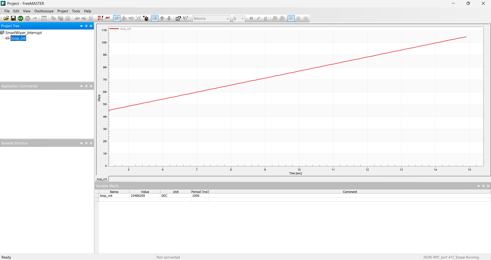
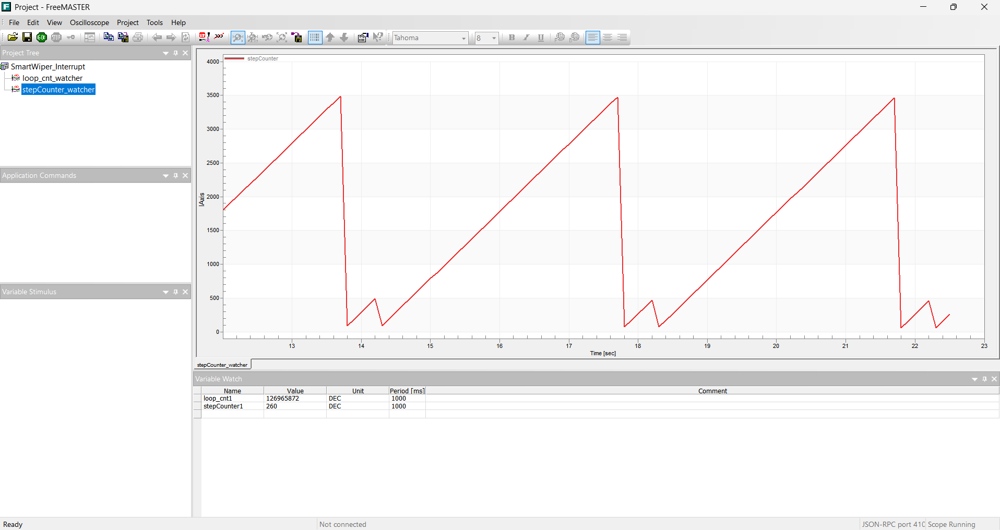

# 05_smart_wiper_interrupt

## 📌 프로젝트 개요

본 프로젝트는 S32K144 MCU를 활용한 스마트 와이퍼 제어 시스템의 4번째 버전으로, 기존 메인 루프(Main Loop) 기반의 폴링(Polling) 제어 방식에서 벗어나 **10ms 하드웨어 타이머(LPIT) 인터럽트 기반의 상태 머신(State Machine) 아키텍처**로 구조를 혁신한 버전입니다.

## 🏗 핵심 아키텍처 변경 사항 (v3 vs v4)

* **과거 (v3)**: `main` 루프 안에서 현재 시간과 목표 시간을 비교(`if(currentTime - lastTime >= moveDuration)`)하며 폴링 방식으로 모터를 제어.
* **현재 (v4)**: `main` 루프는 통신(`FMSTR_Poll`)과 시스템 잉여 체력 측정(`loop_cnt++`)만 전담하며, **와이퍼 제어 로직은 10ms마다 발생하는 LPIT ISR(인터럽트 서비스 루틴)로 완전히 분리**함.

## 💡 주요 기술 및 설계 철학

### 1. 하드웨어와 소프트웨어의 분업 (Timing & Sequence)

* **LPIT (하드웨어)**: 10ms(80,000 Ticks @ 8MHz 클럭)마다 정확하게 알람을 울려 CPU를 깨움 (메트로놈 역할).
* **ISR (소프트웨어)**: 알람이 울릴 때마다 변수(`stepCounter`)에 10씩 더하며 소프트웨어 스톱워치 구현.

### 2. State Machine 설계의 '관통(Fall-through)' 기법

ISR 내부에서 `if - else if`로 모든 상태를 묶지 않고, `WIPER_IDLE` 상태 체크 후 상태가 변하면 즉시 다음 `if`문(`MOVING_UP` 등)을 평가하도록 설계했습니다. 이를 통해 상태 전환 시 10ms의 딜레이(지연)를 없애고 **즉각적인 응답성(Responsiveness)**을 확보했습니다.

### 3. 변수의 Scope와 Lifetime 최적화

* `ms_ticks`: 시스템 부팅 후 총 구동 시간을 추적하는 절대 시간 (전역 변수).
* `stepCounter`: 현재 상태(Step)에서 머문 시간을 측정하는 상대 시간. (본래 ISR 내부의 `static` 변수로 캡슐화하였으나, FreeMASTER 디버깅 및 톱니파 관측을 위해 `volatile` 전역 변수로 승격시킴).
* `currentMode` / `currentStep`: `main.c` 내 어디서든 접근 가능하도록 File-scope `static` 전역 변수로 선언하여 데이터 은닉과 접근성을 동시에 충족.

## 📊 성능 및 검증 결과 (FreeMASTER 활용)

### 1. CPU 연산 효율 (Headroom) 증가

메인 루프에서 무거운 제어 조건문 검사를 덜어낸 결과, 메인 루프의 회전 속도(`loop_cnt`)가 v3 대비 **약 16% 향상** (9초 기준 6M -> 7M) 되었습니다. 확보된 CPU 잉여 체력은 향후 통신이나 복잡한 필터링 연산 처리에 활용될 수 있습니다.

### 2. 완벽한 정시성 (Determinism) 증명

FreeMASTER의 오실로스코프를 통해 `stepCounter`의 톱니파(Sawtooth Wave)를 관측했습니다.

* `MODE_INT` (왕복 500ms + 대기 3000ms = 총 3500ms) 설정 시, 0에서 3500까지 도달하는 데 걸리는 가로축 시간을 측정한 결과 **정확히 3.5초(대략 4초 내외)가 소요됨**을 증명.
* Jitter(시간 오차) 없이 빗변이 일직선으로 곧게 뻗는 것을 확인하여, 통신 부하에 상관없이 10ms 인터럽트가 완벽하게 동작하고 있음을 교차 검증함.

## 🛠 트러블슈팅 (Troubleshooting)

* **문제**: ISR 내부의 `static` 변수를 전역 변수로 변경한 후, FreeMASTER에서 값이 0으로 고정되는 현상 발생.
* **원인**: 변수의 메모리 주소가 변경되었으나, FreeMASTER가 기존 `.elf` 파일의 옛날 주소(심볼)를 바라보고 있었음.
* **해결**: FreeMASTER의 Variable Watch 창에서 변수를 삭제하고, 갱신된 `.elf` 파일(MAP)을 불러와 변수를 재등록하여 해결.
* **주의사항**: 가변저항 값이 낮아 `MODE_OFF` 상태에 빠져있으면 카운터가 무조건 0으로 리셋되므로, 측정 시 반드시 가변저항을 돌려 다른 모드(INT, LOW, HIGH)로 진입해야 함.

## 🚀 Next Step (v5 계획)

1. **아키텍처 모듈화 (Refactoring)**: `main()` 함수 내부의 각종 하드웨어 초기화 코드를 용도별 함수로 분리하여 AUTOSAR 레이어링 사상의 기초 마련.
2. **시각적 피드백 (LED)**: 와이퍼 모드(OFF, INT, LOW, HIGH)에 따른 RGB LED 상태 표시 기능 추가.
3. **디지털 필터링 (DSP)**: ADC 가변저항의 아날로그 노이즈를 제거하기 위해 10ms ISR 내부에 **이동 평균 필터 (Moving Average Filter)** 로직 도입 예정.
