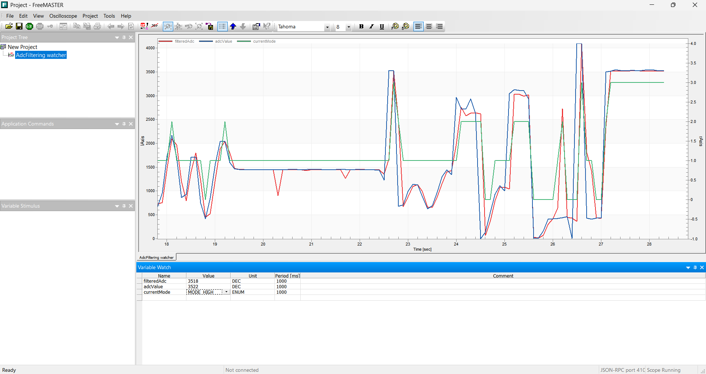
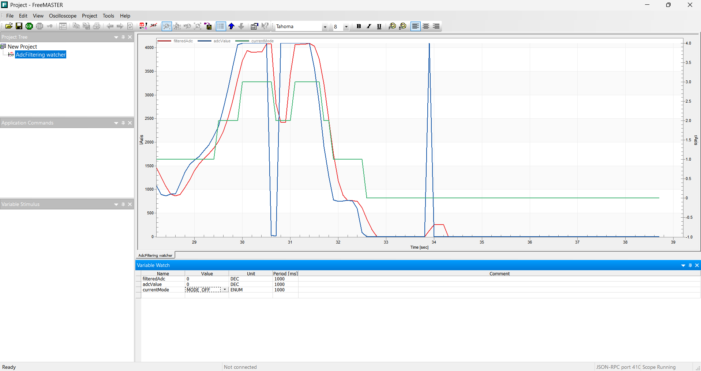

# 📑 Project: SmartWiper_Refactored_DSP_v5

## 🎯 프로젝트 개요
본 프로젝트는 S32K144 MCU를 활용한 스마트 와이퍼 시스템의 최종 진화 버전(v5)입니다. 이전 버전(v4)의 인터럽트 기반 상태 머신 아키텍처를 계승하면서, **코드 구조의 모듈화(Refactoring)**, **디지털 신호 처리(DSP)를 통한 노이즈 제거**, 그리고 **하드웨어/소프트웨어를 아우르는 안전 로직(Failsafe)**을 통합하여 산업용 수준의 신뢰성을 확보하는 것을 목표로 합니다.

## 🏗️ 핵심 아키텍처 및 개선 사항 (v4 vs v5)
* **코드 모듈화 (Refactoring)**: `main()` 함수 내의 복잡한 초기화 코드를 하드웨어 레이어별(System, Sensor, Motor, Timer, Comm, LED)로 분리하여 AUTOSAR 스타일의 추상화 계층을 구현.
* **디지털 신호 처리 (DSP)**: 이동 평균 필터(Moving Average Filter)를 도입하여 가변저항의 아날로그 노이즈를 수학적으로 제거.
* **안전 기능 강화 (Failsafe)**: 센서 단선 및 급격한 신호 변화를 감지하여 시스템을 안전 상태(Safe-State)로 강제 전이시키는 로직 구현.

## 🧠 주요 기술 세부 사항

### 1. LED 시각적 피드백 (Visual Feedback)
E2E(End-to-End) 프로세스에 따라 하드웨어 회로 분석부터 레지스터 제어까지 통합 구현되었습니다.
* **하드웨어 분석 (Active Low)**: 보드의 RGB LED는 Anode(+)가 VDD에 공통 연결되고 Cathode(-)가 MCU 핀에 연결된 구조입니다. 핀에 **0(Low)**을 출력하여 전위차를 발생시켜야 불이 켜지는 **Active Low** 방식을 적용했습니다.
* **핀 맵(Pin Map)**: Red(`PTD15`), Green(`PTD16`), Blue(`PTD0`).
* **Bare-metal 레지스터 제어**:
    * **PCC**: Port D 모듈의 클럭(심장박동) 활성화.
    * **PORT (PCR)**: MUX 값을 1로 설정하여 핀 기능을 GPIO로 할당.
    * **GPIO (PDDR/PDOR)**: 비트 마스킹(`|=`, `<<`) 연산을 통해 기존 비트를 보존하며 특정 LED만 정교하게 제어.
* **모드별 상태 표시**:
    * `MODE_OFF`: 모든 LED OFF
    * `MODE_INT`: **Blue** ON
    * `MODE_LOW`: **Green** ON
    * `MODE_HIGH`: **Red** ON

### 2. Moving Average Filter (DSP)
가변저항의 물리적 특성으로 인한 미세한 값 요동을 억제하기 위해 최신 8개 샘플의 평균을 계산합니다.
* **연산 최적화**: 임베디드 리소스 효율을 위해 나눗셈 대신 비트 시프트(`>> 3U`) 연산 사용.
* **Trade-off**: 필터 사이즈가 커질수록 신호는 부드러워지지만, 반응 지연(Latency)이 발생함을 FreeMASTER를 통해 검증(32개 샘플 vs 8개 샘플).

### 3. 하이브리드 Failsafe 전략
단순한 소프트웨어 체크를 넘어 하드웨어적 한계를 보완하는 다중 방어 체계를 구축했습니다.
* **Range Check**: ADC 유효 범위(50 ~ 4040) 이탈 시 단선 혹은 쇼트로 판단.
* **Delta Check**: 10ms 내 허용 불가능한 수준(1500U 이상)의 급격한 값 변화 감지 시 결함 처리.
* **Hardware Fix (Pull-down)**: 신호선 단선 시 발생하는 **플로팅(Floating)** 현상(값이 3500~4000 사이로 유령처럼 치솟음)을 근본적으로 해결하려면 100kΩ 풀다운 저항을 추가하여 단선 시 0V로 수렴하도록 설계.

## 📍 하드웨어 구성 및 배선 (Wiring)
Canva를 활용하여 설계된 최신 배선도를 기반으로 구성되었습니다.

| 부품 | 핀 이름 | EVB 보드 핀 | 비고 |
| :--- | :--- | :--- | :--- |
| **가변저항** | Signal (Center) | **J4-05 (PTB0)** | ADC0_SE8, 100kΩ Pull-down 저항 연결 |
| **서보모터** | Signal (Orange) | **J4-9 (PTC0)** | FTM0_CH0 (PWM 출력) |
| **RGB LED** | R / G / B | **PTD15 / 16 / 0** | Active Low 제어 (Red/Green/Blue) |
| **공통 전원** | 5V / GND | **J3-09 / 11** | 빵판 파워 레일 공통 연결 |

## 📊 검증 결과 (Fault Injection Test)
FreeMASTER를 통해 실시간으로 결함 주입 테스트를 수행하고 안전성을 증명했습니다.

### 1. 결함 시나리오별 결과
| 테스트 케이스 | 주입 결함 (Fault) | 관측된 ADC 값 | 시스템 동작 (Mode) |
| :--- | :--- | :--- | :--- |
| **Case 1** | **VCC(+) 단선** | 4095 근처 (치솟음) | **OFF 모드** (Failsafe 발동) |
| **Case 2** | **GND(-) 단선** | 4095 근처 (치솟음) | **OFF 모드** (Failsafe 발동) |
| **Case 3** | **Signal 단선** | 3500 ~ 4000 (Floating) | **HIGH 모드** (임계값 내 진입) |
| **Case 4** | **전원/GND 동시 단선** | 3500 ~ 4000 (Floating) | **HIGH 모드** (임계값 내 진입) |

### 2. 하드웨어적 한계 분석 및 대책
* **플로팅(Floating) 현상 확인**: 신호선 단선 혹은 전원 차단 시, MCU의 높은 입력 임피던스로 인해 핀이 안테나 역할을 수행하여 ADC 값이 유령처럼 치솟는 현상을 그래프로 포착했습니다.
* **개선책**: 이를 근본적으로 해결하기 위해 보드 입력단(Signal-GND 사이)에 **100kΩ Pull-down 저항** 배치를 결정했습니다. 이를 통해 단선 시 강제로 0V로 수렴시켜 완벽한 `MODE_OFF` 진입을 유도할 수 있습니다.

### 3. 실시간 검증 스크린샷
#### 1.  **VCC/GND 단선 테스트**: ADC 값이 즉시 범위 외(0 또는 4095)로 이동하며 와이퍼가 `MODE_OFF`(0도)로 복귀함을 확인.
GND_fail.png)
VCC_fail.png)

#### 2.  **신호선(Signal) 단선 테스트**: 풀다운 저항 설치 후, 선이 빠지는 즉시 ADC 값이 3500 ~ 4000 이 되어 HIGH mode가 됨.
Signal_fail.png)

#### 3. **필터링 성능**: 노이즈가 심한 생데이터(`adcValue`) 환경에서도 필터링된 데이터(`filteredAdc`)는 안정적인 곡선을 그리며 LED 떨림 현상을 완벽히 억제함.

## 🚀 Lessons Learned
* **하드웨어가 법이다**: LLM의 가이드보다 회로도와 데이터시트(RM)의 핀 맵이 우선임을 깨달음 (PTD13/14 사건).
* **방어적 프로그래밍**: "하드웨어는 언제든 고장 날 수 있다"는 비관적 관점이 안전한 시스템을 만듦을 체득.
* **플로팅 현상의 이해**: MCU의 높은 입력 임피던스로 인해 단선된 핀이 안테나 역할을 하여 유령 값이 발생하는 원리를 파악하고 하드웨어적 해결책 도출.

## 📅 향후 계획
* [ ] **CAN Communication**: BCM(Master)과 와이퍼(Slave) 간의 통신 기반 제어 시스템 확장 예정.

---
