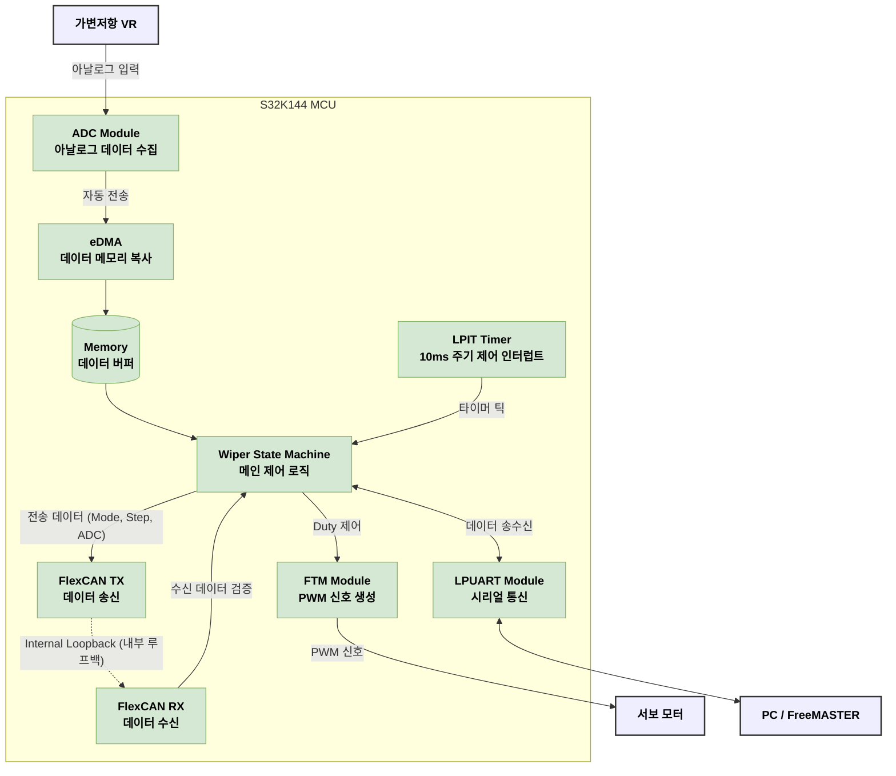

# 📑 Project Report: SmartWiper_CAN_v6
**"단일 노드 CAN Loopback 통신 구현 및 데이터 정밀 모니터링"**

## 1. 개요
* **목적**: S32K144 MCU의 FlexCAN 모듈을 사용하여 가변저항(ADC) 데이터를 자기 자신에게 송수신(Loopback)하고, 제어 로직의 무결성을 검증함.
* **핵심 도전**: 하드웨어 전원 문제, 디버깅 환경(Port) 충돌, 12비트 데이터의 8비트 분할 전송 로직 구현.

---

## 2. 시스템 아키텍처 (System Architecture)

전체 시스템은 S32K144 MCU를 중심으로 센서 입력, 구동 출력, PC 모니터링, 그리고 CAN 내부 통신으로 구성됩니다.



---

## 3. 1대 EVB CAN 통신 (Loopback) 하드웨어 및 소프트웨어 설정

1대의 테스트 보드에서 CAN 통신을 하기 위해서는 추가적인 보드 없이 내부적으로 신호를 되돌려받는 **Loopback(루프백)** 모드를 사용해야 합니다.

### ① 하드웨어 설정 (Hardware Setup)
* **배선 연결 생략**: 루프백 모드에서는 MCU 내부에서 TX가 RX로 직접 연결되므로, 핀(CAN_H, CAN_L)에 점퍼선을 달거나 종단 저항(Terminal Resistor)을 꽂지 않아도 테스트가 가능합니다.

### ② 소프트웨어 설정 (Software Setup - Processor Expert)
* **FlexCAN Component 모드 설정**: S32 Design Studio의 `flexcan` 컴포넌트(Inspector) 설정에서 **`FlexCAN Operation Mode`** 항목을 `Normal`이 아닌 **`Loopback`** 모드로 지정합니다.
* 이렇게 설정하면 `Generated_Code/canCom1.c` 파일의 `canCom1_InitConfig0` 구조체에 `.flexcanMode = FLEXCAN_LOOPBACK_MODE`로 자동 반영되어, 코드를 굽기만 하면 송신 데이터가 그대로 수신 인터럽트를 발생시키게 됩니다.

---

## 4. 주요 트러블슈팅 및 해결 과정

### [환경 설정] 소켓 바인딩 실패 (Port Address already in use)
* **현상**: S32DS에서 디버깅 시작 시 "Could not bind socket. Address and port are already in use" 에러 발생.
* **진단**: `netsh interface ipv4 show excludedportrange protocol=tcp` 명령어로 확인한 결과, 윈도우 시스템(Hyper-V/WSL 등)이 하필이면 GDB 서버 기본 포트(7224, 6224) 대역을 **예약 구역(Excluded Range)**으로 묶어버린 것을 발견.
* **해결**: Debug Configurations에서 포트 번호를 시스템 예약 구역이 아닌 **8224, 8225**번으로 강제 변경하여 충돌 해결.

---

## 5. 소프트웨어 설계 및 통신 로직

### ① CAN 데이터 패킹 및 언패킹
12비트 ADC 값을 8비트 기반의 CAN 데이터 필드(4바이트)에 담기 위해 비트 연산 수행.

```c
/* Sources/flexcan_hw.c 내 송신 함수 */
canData[0] = (uint8_t)(adc_val >> 8U);    // 상위 4비트 (0~15 범위)
canData[1] = (uint8_t)(adc_val & 0xFFU);  // 하위 8비트 (0~255 범위)
canData[2] = mode;                         // Wiper Mode (0~3)
canData[3] = step;                         // Wiper Step (0~2)
```

### ② Wiper 제어 상태 머신 (Mode vs Step)
데이터 모니터링 과정에서 두 값의 차이점을 명확히 정의함.
* **Wiper Mode**: 가변저항에 의한 **사용자의 명령(Goal)**. (OFF, INT, LOW, HIGH)
* **Wiper Step**: 명령을 수행하기 위한 **물리적 동작 상태(Progress)**. (IDLE, UP, DOWN)
    * *특징*: Mode가 `LOW`로 고정되어도, 와이퍼 날은 계속 움직여야 하므로 Step 값은 실시간으로 `1(UP)`과 `2(DOWN)` 사이를 왕복함.

---

## 6. 데이터 시각화 (FreeMASTER)

### ① 가상 변수(Virtual Variable)의 한계와 극복
* **시도**: `(data[0] * 256) + data[1]` 수식을 통해 $0 \sim 4095$ 원본 ADC 값을 복원하려 함.
* **문제**: FreeMASTER 버전 특성상 `Linear: ax+b` 설정의 `a`, `b` 칸에 변수 이름을 넣으면 숫자로 인식되지 않아 계산 결과가 하위 바이트 값($239$ 등)에 고정되는 현상 발생. data[0]의 값이 0으로 읽힘.
* **대안**: **메모리 오버레이(Memory Overlay)** 방식 사용. `rx_msg.data[0]` 주소를 직접 참조하여 2바이트 **Big-Endian(Motorola)** 방식으로 읽어 복잡한 수식 없이 16비트 데이터를 추출하려고 했지만 실패.

### ② 텍스트 라벨링 (Text Enumeration)
* 숫자(0, 1, 2)로 표시되던 상태값을 `Text Enumeration` 기능을 통해 `INT`, `MOVING_UP` 등 직관적인 텍스트로 변환하여 가독성 확보.

---

## 7. 시스템 최적화 및 안정화 리포트

**1) ISR Diet 및 스케줄링 구조 개편**
- **기존 문제**: 10ms 인터럽트(ISR) 내부에 필터링, 상태 머신, PWM 업데이트 등 무거운 로직이 집중되어 시스템 응답성 저하 우려.
- **해결 방안**: ISR은 '타이머 플래그(`timer_10ms_flag`) 세팅'만 수행하고 즉시 종료. 실제 제어 로직은 Main Loop에서 플래그를 확인하여 수행하는 Flag-based Scheduling 구조 도입.
- **효과**: 인터럽트 지연 시간(Latency) 최소화 및 통신 인터럽트의 안정적 수신 환경 확보.

**2) CPU 부하 분석 및 Slack Time 측정**
- **측정 방법**: 10초간 `while(1)` 루프가 회전하는 횟수(`loop_cnt`)를 기준으로 부하 측정.
- **측정 결과**:
  - Baseline (No Task): 12.7M 회 (10s 기준)
    <br>
  - Active (Wiper Task On): 4.7M 회 (10s 기준)
    <br>
- **분석 결과**: CPU 사용률 약 63%, 여유율(Slack Time) 37%. 자동차 제어 시스템의 안정권(70% 이하) 내에서 작동함을 데이터로 검증.

**3) CAN 진단 로직 및 Failsafe 강화 (Observability)**
- **CAN 상태 모니터링**: `ESR1` 레지스터를 직접 참조하여 `Check_CAN_Status()` 구현. ACK 에러 등을 실시간 감지.
- **에러 주입 테스트**: `can_ack_err_cnt` 수동 조작(11회 이상)을 통해 Failsafe 모드(`MODE_OFF` 고정 및 LED 경고) 진입 확인.
- **Latch 방식 복구**: 에러 발생 시 자동 복구가 아닌, 사용자의 수동 리셋 요청(`errorResetRequest`)이 있을 때만 정상 모드로 복귀하는 안전 지향형 복구 로직 적용.

**4) MISRA-C:2012 규칙 준수**
- 고정 크기 데이터 타입(`uint32_t` 등) 사용, `volatile` 키워드를 통한 공유 변수 보호, 매직 넘버 상수화 등 자동차 SW 표준 규격에 맞춘 리팩토링 완료.

---

## 8. 최종 학습 성과
1.  **회로도 독해 능력**: 전원 계통 및 핀 맵 분석을 통한 하드웨어 트러블슈팅 능력 배양.
2.  **네트워크 진단**: OS 레벨의 포트 점유 문제를 파악하고 우회하는 엔지니어링 센스 습득.
3.  **임베디드 통신 숙달**: 비트 연산을 이용한 데이터 핸들링과 CAN 프로토콜의 Endianness에 대한 깊은 이해.
