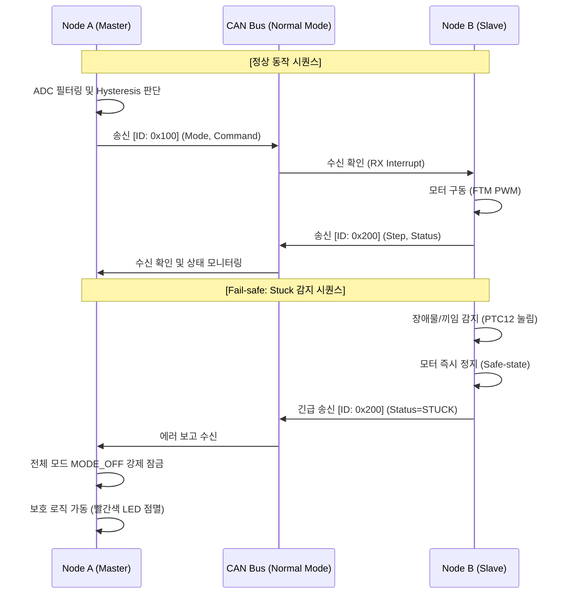

# 📑 프로젝트 기술 리포트: SmartWiper_Dual_Node_CAN_v7

**"분산 제어 기반의 실시간 양방향 CAN 통신 및 지능형 와이퍼 제어 시스템"**

---

## 🎯 1. 프로젝트 개요 (Project Overview)
본 프로젝트는 단일 보드 내장 통신(Loopback, v6)의 한계를 극대화하여, **두 개의 S32K144 EVB 노드(Master/Slave) 간 물리적 CAN 네트워크를 통한 실시간 양방향 분산 제어 시스템**을 성공적으로 구축한 결과물입니다. 
산업용 소프트웨어 표준인 AUTOSAR 아키텍처의 철학을 반영하여 **APP / HAL / MCAL 3계층 분리(Layering) 아키텍처**를 적용하였으며, 이를 통해 높은 수준의 추상화(Abstraction)와 캡슐화(Encapsulation)를 달성하였습니다.

---

## 🔌 2. 하드웨어 구성 및 배선 (Physical Layer)
물리 계층(Physical Layer)에서의 신호 무결성(Signal Integrity)과 노이즈 내성을 확보하기 위해 다음과 같은 전장 설계를 적용하였습니다.

* **Power (전원 및 접지)**: 서보모터 구동 시 발생하는 역기전력 및 전압 강하를 막기 위해 **외부 5V 독립 전원**을 사용하였으며, 노드 간 통신 기준 전압을 맞추기 위해 브레드보드를 통한 **Common GND (공통 접지)** 묶임(Tying) 처리를 완벽히 수행하였습니다.
* **Communication (통신 선로)**: S32K144 EVB의 J13 점퍼를 이용해 **120Ω 종단 저항(Termination Resistor)**을 닫아 CAN 버스의 신호 반사를 억제했으며, CAN_H와 CAN_L을 트위스티드 페어(Twisted Pair)로 연결하였습니다.

### 📌 노드별 핀맵 (Super-set Pinmux 적용)
| 기능 / 부품 | Node A (Master) 연결 핀 | Node B (Slave) 연결 핀 |
| :--- | :--- | :--- |
| **ADC (가변저항)** | `PTA0` (ADC0_SE0) | 사용 안 함 |
| **PWM (서보모터)** | 사용 안 함 | `PTC0` (FTM0_CH0, ALT2) |
| **SW2 (버튼 1)** | `PTC12` (자동/수동 모드 토글) | `PTC12` (장애물 감지 / Stuck 발생) |
| **SW3 (버튼 2)** | `PTC13` (단발 구동 트리거) | `PTC13` (에러 상태 복구 / Clear) |

---

## 🏗️ 3. 소프트웨어 아키텍처 (Software Layering)

이 프로젝트의 핵심 소프트웨어 공학적 성과는 **"하나의 소스 코드로 두 보드를 모두 제어하는 플랫폼 소프트웨어"**를 구축했다는 점입니다.

* **Single Source, Multi-Variant**: 소스 코드 내 `#define CURRENT_NODE` 매크로(전처리기) 하나만 변경하면 Node A 펌웨어와 Node B 펌웨어가 선택적으로 빌드됩니다. 
* **Super-set Pinmux**: 두 보드가 사용하는 모든 하드웨어 핀(ADC, PWM, GPIO)을 하나의 `pin_mux.c`에 통합하여, 타겟 칩이 바뀌더라도 유지보수가 극도로 간결해집니다.

### 📊 3계층 아키텍처 역할 명세서
| 계층 (Layer) | 파일명 | 수행 역할 및 설계 의도 |
| :--- | :--- | :--- |
| **APP Layer**<br>(Application) | `wiper_app.c` | 하드웨어에 종속되지 않는 순수 비즈니스 로직(FSM).<br>Node A: 이동 평균 필터(DSP), 히스테리시스 모드 판별.<br>Node B: 모터 제어 단계(Step) 제어 및 에러 판별. |
| **HAL Layer**<br>(Hardware Abstraction) | `wiper_hal.c` | APP이 하드웨어를 쉽게 호출하도록 래핑(Wrapping)된 API 제공.<br>`#if` 분기를 통해 자신이 속한 노드에 필요한 하드웨어(ADC 또는 모터)만 초기화함. |
| **MCAL Layer**<br>(Microcontroller) | `flexcan_hw.c`<br>`Generated_Code` | NXP S32 SDK 및 레지스터 직접 제어.<br>FlexCAN Normal 모드 구동 및 RX/TX MB(Message Buffer) 제어. |

---

## 📡 4. 통신 프로토콜 및 기능 로직 (Protocol & Logic)

일방적인 명령 하달이 아닌, 서로의 상태를 묻고 답하는 **Closed-loop 제어**를 구현했습니다.

### 🔄 Bidirectional CAN Protocol
* **[A → B] 명령 전송 (ID: `0x100`)**: Node A가 판단한 현재 제어 모드(Auto/Manual)와 산출된 와이퍼 동작 명령을 Node B로 전송.
* **[B → A] 상태 텔레메트리 (ID: `0x200`)**: Node B가 스스로 인지한 현재 하드웨어 동작 단계와 오류 상태(Normal/Stuck)를 Node A에게 역으로 보고.

### 🛡️ Advanced Fail-safe (지능형 안전 로직)
자동차 전장 시스템의 최우선 과제인 '안전 기능'을 3중으로 구현하였습니다.
1. **Communication Timeout (통신 두절 감지)**: 
   * 양측 노드 모두 `can_ack_err_cnt`와 `RX Timeout(500ms)`을 감시합니다.
   * 디버거 정지나 선로 단선으로 메시지가 끊기면 즉시 `is_can_failsafe = true`로 전환되어 모터를 가장 안전한 위치(0도)로 원복시킵니다.
2. **Stuck Detection (기계적 부하 차단)**: 
   * Node B에서 물리적 끼임(장애물) 버튼이 눌리면, 그 즉시 서보모터 PWM 출력을 정지(IDLE)시키고 Node A에게 `STATUS_STUCK`을 송신하여 시스템 전체를 `MODE_OFF` 로 잠급니다.
3. **Sensor Fault Protection (센서 플로팅 방어)**: 
   * Node A의 ADC 핀이 빠져 값이 치솟거나(플로팅), 비정상 델타값 스파이크가 발생하면 코어 로직이 이를 불량 센서로 간주하여 구동을 원천 차단합니다.

---

## 🖼️ 5. 시스템 아키텍처 다이어그램 (System Diagrams)

### 5.1 전체 물리 아키텍처 (Overall Architecture)
Node A(마스터), Node B(슬레이브), 그리고 PC(FreeMASTER) 연결까지 포함한 전체 물리적 인터페이스 구조입니다.

```mermaid
graph LR
    PC["🖥️ PC (FreeMASTER)"] <==>|UART/USB<br/>데이터 로깅 & 상태 모니터링| NodeA

    subgraph "Node A (Master / Control)"
        direction TB
        A_ADC["🌡️ 가변저항 (ADC)"] -->|PTA0| NodeA["⚙️ MCU (S32K144)"]
        A_SW2["🔘 SW2 (자동/수동)"] -->|PTC12| NodeA
        A_SW3["🔘 SW3 (단발 동작)"] -->|PTC13| NodeA
    end

    NodeA <==>|"통신 선로 (CAN Bus)<br/>120Ω 종단<br/>ID: 0x100 / 0x200"| NodeB

    subgraph "Node B (Slave / Actuator)"
        direction TB
        NodeB["⚙️ MCU (S32K144)"] -->|PTC0 (PWM)| B_Motor["🔄 서보모터 (Wiper)"]
        B_SW2["⚠️ SW2 (Stuck 발생)"] -->|PTC12| NodeB
        B_SW3["✅ SW3 (에러 복구)"] -->|PTC13| NodeB
    end
```

### 5.2 제어 시퀀스 흐름도 (Sequence Flow)


